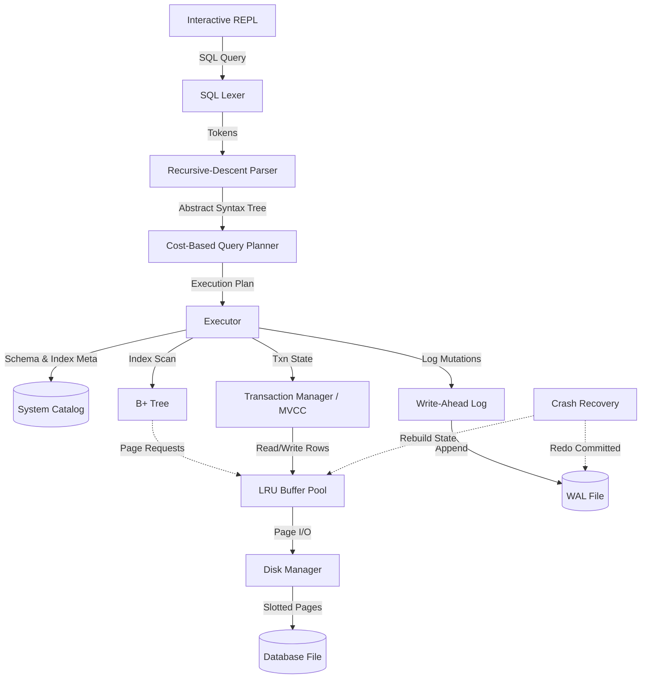

# mydb

A relational database engine built from scratch in Node.js, layer by layer, over 8 weeks. It features a slotted-page storage engine, B+ Tree indexing, a custom SQL lexer/parser, a cost-based query planner, write-ahead logging (WAL) for crash recovery, and Multi-Version Concurrency Control (MVCC) for transaction isolation.

---

## Architecture



---

## Features

- **Storage Engine**: A slotted-page storage architecture handling file reads/writes, wrapped by an in-memory LRU Buffer Pool.
- **B+ Tree Indexing**: Implemented `BPlusTree` indexing for fast lookups, insertions, and logarithmic `O(log N)` complexity.
- **SQL Parsing**: A custom Lexer and recursive-descent Parser producing a structural Abstract Syntax Tree (AST).
- **Cost-Based Query Planner**: Evaluates disk I/O costs to selectively choose between a sequential scan and an index scan based on data selectivity.
- **WAL & Crash Recovery**: A Write-Ahead Log to record mutations, ensuring durability and the ability to rebuild the database after a hard crash (replaying committed rows and skipping uncommitted ones).
- **MVCC Isolation**: Multi-Version Concurrency Control providing read-committed transactional isolation without blocking concurrent reads.

---

## Project Structure

```text
mydb/
├── benchmarks/              # Performance and reliability benchmarking scripts
├── data/                    # Database (*.db) and WAL (*.wal) files
├── src/
│   ├── executor/            # Execution engine (index scans, seq scans, MVCC)
│   ├── index/               # B+ Tree implementation
│   ├── sql/                 # Lexer, Parser, and Cost-Based Planner
│   ├── storage/             # Slotted Pages, LRU Buffer Pool, Disk Manager
│   ├── transaction/         # WAL, Crash Recovery, and Transaction Manager
│   ├── catalog.js           # In-memory schema and index tracking
│   ├── repl-format.js       # Formatting utilities for the REPL
│   └── repl.js              # Interactive SQL shell
├── tests/                   # Unit and integration test suite
├── demo-*.js                # Step-by-step demonstrations of core concepts
├── package.json
└── README.md
```

---

## Getting Started

1. **Install dependencies** (if any):
   ```bash
   npm install
   ```

2. **Start the interactive REPL**:
   ```bash
   npm start
   ```

---

## Testing & Demonstrations

The project includes unit tests tracking the progress of each system layer, as well as step-by-step demonstration scripts.

### Running the Test Suite
```bash
npm run test:storage
npm run test:btree
npm run test:parser
npm run test:executor
npm run test:recovery
npm run test:mvcc
npm run test:planner
```

### Running Demonstrations
You can explore specific subsystems via the provided demo scripts:
- `npm run demo:storage` (Storage Engine & Buffer Pool)
- `npm run demo:btree` (B+ Tree)
- `npm run demo:executor` (Catalog & Execution)
- `npm run demo:recovery:step1` (Crash Simulation)
- `npm run demo:recovery:step2` (Crash Recovery)
- `npm run demo:mvcc` (Isolation Levels)
- `npm run demo:planner` (Cost-based Query Planning)

---

## Benchmarks

The `benchmarks/` directory contains standalone scripts profiling the characteristics of the database.

<details>
<summary><b>1. <code>bench:scan</code> (Index Scan vs Sequential Scan)</b></summary>

Proves the index scan speedup. Profiles `seqScan` vs `indexScan` on a highly selective query against padded rows spanning multiple disk pages.
```bash
npm run bench:scan
```
*Results:*
```text
> mydb@1.0.0 bench:scan
> node benchmarks/bench-scan.js

Setting up DB...
Inserting 5000 rows...
Benchmarking Seq Scan...
Benchmarking Index Scan...

==============================================
             SCAN BENCHMARK RESULTS           
==============================================
Rows Scanned    : 5000
Seq Scan Avg    : 17.947 ms
Index Scan Avg  : 0.071 ms
Matches Found   : 1 (Seq) / 1 (Index)
Speedup         : 253.1x faster
==============================================

Note: With only 5000 rows across a handful of pages, the speedup 
may be modest (or even reversed for tiny datasets, since hitting 3 B+ Tree 
levels has fixed overhead). The real win shows up as table size grows, 
since seq scan cost grows linearly with page count while index scan stays 
roughly flat. If you want a bigger gap, bump rowCount to 50000+.
```
</details>

<details>
<summary><b>2. <code>bench:concurrency</code> (MVCC Isolation)</b></summary>

Proves MVCC isolation. Runs concurrent transactions reading and writing simultaneously, verifying that a dirty read does not occur and committed data is accurately observed.
```bash
npm run bench:concurrency
```
*Results:*
```text
> mydb@1.0.0 bench:concurrency
> node benchmarks/bench-concurrency.js

Setting up DB for MVCC Concurrency Test...

--- Starting Test ---
[TxnA] Started (id: 1)
[TxnA] Inserted (id=1, balance=100), but NOT COMMITTED yet.
[TxnB] Started concurrently (id: 2)
[planner] no usable index (MVCC)
✅ PASSED: txnB correctly could not see txnA's uncommitted insert

[TxnA] Committing now...
[TxnA] Committed.

[TxnC] Started after TxnA commit (id: 3)
[planner] no usable index (MVCC)
✅ PASSED: txnC correctly sees txnA's committed data

[TxnB] Reading again (still open from earlier)...
[planner] no usable index (MVCC)
[TxnB] Found 1 rows.
       Note: Under this read-committed-style MVCC model, TxnB WILL now see
       the newly committed row, even though it didn't see it earlier.
       This is a known characteristic of read-committed isolation.

==============================================
                 SUMMARY                      
==============================================
RESULT: ✅ All 2 tests passed successfully
```
</details>

<details>
<summary><b>3. <code>bench:crash</code> (WAL Recovery)</b></summary>

Proves crash resilience. Spawns a dedicated worker process running a transaction, forcibly kills it (`SIGKILL`) midway through a secondary uncommitted transaction, and verifies the exact committed state using the WAL.
```bash
npm run bench:crash
```
*Results:*
```text
> mydb@1.0.0 bench:crash
> node benchmarks/bench-crash-recovery.js

Spawning worker process...
Force-killing worker process (SIGKILL) to simulate a crash...
Recovering...
Recovery complete: replayed 3 inserts, skipped 0 deletes.
[planner] no usable index
Data in 'logs' table after recovery:
[
  {
    createdByTxn: 1,
    deletedByTxn: null,
    data: { id: 1, message: 'Log 1' }
  },
  {
    createdByTxn: 1,
    deletedByTxn: null,
    data: { id: 2, message: 'Log 2' }
  },
  {
    createdByTxn: 1,
    deletedByTxn: null,
    data: { id: 3, message: 'Log 3' }
  }
]

==============================================
                 SUMMARY                      
==============================================
RESULT: ✅ PASS. Exactly 3 committed rows recovered; uncommitted row absent.
```
</details>

---

## Known Limitations / Future Exercises

As a pedagogical project built over an 8-week period, certain compromises and simplifications were intentionally made:
- **Ephemeral Schemas**: Table schemas (the catalog) are not persisted across restarts; `CREATE TABLE` must be re-run each session.
- **No Vacuuming**: Deleted physical slots and old MVCC row versions are never compacted or reclaimed.
- **Read-Committed MVCC**: The MVCC implementation operates closer to "read-committed" style rather than true snapshot isolation.
- **Logical Redo Recovery**: The WAL recovery does logical (not physical) redo and skips replaying deletes.
- **Single Process**: The architecture expects single-process usage. There is no concurrent multi-process access support (single Node process only).

---

## Resume

If you are incorporating this project into your resume, you can use the following bullet point:

> **Engineered a relational database engine in Node.js featuring a B+ Tree index, WAL-based crash recovery, MVCC transaction isolation, a cost-based query planner, and a custom SQL parser (lexer → AST → execution) supporting SELECT, INSERT, DELETE, and transactions.**
